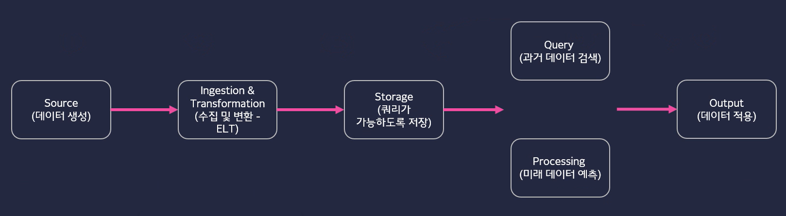
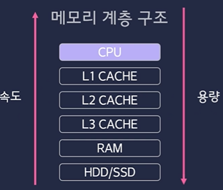
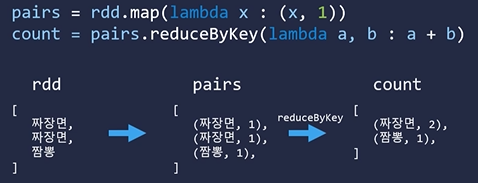

# BigData
----
<강원테크 SW융합교육>

데이터 엔지니어링?
: 빅데이터 기반 의사결정을 만들기 위한 인프라 구성, 인사이트 추출

GIGO(Garbage In Garbage Out)
: 좋은 데이터를 수집하고 잘 관리하고 처리하는 것이 훨씬 효율적이다

과거 데이터 아키텍쳐(문제점)
1. 구축 시스템이 비싸다
2. 데이터의 용도가 정해져있다
3. 데이터 수집처가 일정하다

* ETL
: 데이터의 형식이 지정, 변동이 없는 환경에서의 데이터 파이프 라인
- Extract(추출): 기존의 DB에서 데이터를 가져온다
- Transform(변환): 미리 정해 놓은 스키마에 맞게 데이터를 변환
- Load(적재): 변환이 완료된 데이터를 원하는 스키마에 INSERT하는 과정

현재 데이터 아키텍쳐
1. 다양한 데이터의 형식(스키마 정의가 어렵다)
2. 저렴해진 컴퓨터

* ELT
: 데이터를 추출한 후 선 저장하고 쓰임새에 따라 변환

데이터 아키텍처 분야
- 소스: 비즈니스와 운영 데이터 생성
- 수집 및 변환: ELT
- 저장: 데이터를 처리 시스템이 쓸 수 있도록 저장, 비용과 확장성 면으로 최적화
- 과거, 예측: 저장된 과게 데이터를 통해 인사이트 생성(Query), 쿼리를 실행하고 필요시 분산 처리(Processing), 과거에 일어난 일, 미래에 일어날 일(Machine Learning)
- 출력: 데이터 분석을 내,외부에 제공, 데이터 모델을 운영 시스템에 적용

데이터의 흐름


* Batch Processing(한꺼번)
Batch: 일괄, Processing: 처리
- 많은 양의 데이터를 정해진 시간에 한꺼번에 처리
- 전통적으로 사용한 데이터 처리 방법
- 실시간성을 보장하지 않아도 될 때
- 무거운 처리를 할 때
- 마이크로 배치: 데이터를 조금씩 모아서 프로세싱하는 방식(Spark Streaming)

* Stream Processing(실시간)
- 실시간으로 쏟아지는 데이터를 계속 처리하는 것
- 이벤트가 생길 때, 데이터가 들어올 때 마다 처리
- 불규칙적으로 데이터가 들어오는 환경

---
실습 환경 구비

설치 프로그램
1. Python(anaconda)
2. java 설치(oracle jdk 11) - Spark 구성 언어
3. Hadoop winutils 2.7.7 - Hadoop 환경 간접 설정
4. apache spark 

환경 변수 설정
1. PYSPARK_PYTHON
2. JAVA_HOME
3. HADOOP_HOME
4. SPARK_HOME
---

#### Spark를 이용한 학생 수 카운트

* SparkConf: Spark 설정 옵션 객체, 주로 SparkContext 설정
   - setMaster: Spark가 실행될 위치 설청, local 또는 분산(HDFS) 등을 사용
   - setAppName: 스파크에서 작업할 어플리케이션의 이름, 웹 환경(Spark UI)에서 확인이 가능하다
* SparkContext: Spark 클러스터와 연결 시켜주는 객체
   - Spark의 모든 기능에 접근할 수 있는 시작점
   - Spark는 분산 환경에서 동작하기 때문에 Driver Program을 구동시키기 위해서는 SparkContext가 필요하다
   - SparkContext는 프로그램당 하나만 만들수 있고, 사용후에는 종료해야 한다

* SparkContext 작동 과정
   - SparkContext 객체의 내부는 자바로 동작하는 Py4j의 SparkContext와 소켓을 통해 연결된다.
   - Py4j란 Python되어 있는 코드를 Spark에서 구동 가능한 java 형태의 스칼라로 변환
   - RDD를 만들 수 있다.(Spark에서 사용하는 데이터 구조)

```Python
from pyspark import SparkConf, SparkContext

conf = SparkConf().setMaster("local").setAppName("country-student-counts")

sc = SparkContext(conf=conf)

directory = "C:\\Users\\sonjj\\study_spark\\data"
filename = "xAPI-Edu-Data.csv"

lines = sc.textFile("file:///{}\\{}".format(directory, filename))
lines

header = lines.first()
header

datas = lines.filter(lambda row : row != header)
datas

# collect(): 실제 데이터 확인
datas.collect()[:3]

#국적만 추출하기
countries = datas.map(lambda row : row.split(',')[2])
countries

countries.collect()[:3]

#국적 count
result = countries.countByValue()
result

#시각화
import pandas as pd
import matplotlib.pyplot as plt
import seaborn as sns

series = pd.Series(result, name='countries')
series

plt.figure(figsize=(15, 10))
sns.barplot(x=series.index, y=series.values)
plt.show()
```
---

Hadoop
1. HDFS
   1. 파일 시스템(분산 저장)
2. Map Reduce
   1. 연산 엔진
   2. 데이터 집계
   3. Spark의 주 기능
3. Yarn
   1. 리소스 관리
   2. 클러스터 관리



- 컴퓨터 작업 시 HDD/SSD에서 CPU로 데이터가 이동한다.
- 연산에 자주 사용되는 데이터는 위쪽에 저장
- 연산에 자주 사용되지 않는 데이터는 아래쪽에 저장
- HDD/SSD로 갈수록 용량은 크지만 처리 속도가 현저히 느려지기 때문에 데이터를 어디에 저장할지 잘 판단해야 한다.


- RAM에서 처리하기 힘든 크기의 데이터는 HDD/SSD와 연동하여 처리
- RAM에서 입부 연산할 데이터를 RAM에 적재, 연산 후 결과를 디스크에 저장
- 단, 속도가 현저히 느려진다


- LEADER에서 FOLLOWER을 관리하고, 데이터를 분산하여 전송
- FOLLOWER에서는 LEADER에서 넘겨준 데이터를 받아 실질적인 연산을 처리한다

* Spark에서의 Cluster
  - LEADER역할을 하는 Cluster에서 Dirver Program은 각각의 Worker Node에 연산(Task)을 할당해준다.
  - Worker Node(Follower) Cluster에서는 Executor에서 작업을 수행하고 이를 Cache에 저장한다.
  - Cluster Manager는 어떤 Worker Node에서 Task를 빠르게 수행할 수 있는지 판단하여 분배하는 역할을 한다.

* Lazy Evaluation
  - Task를 정의할 때 연산을 바로 하지 않고, 결과가 필요할 때 연산을 수행한다, 연산 과정을 최적화 한다

* Resilient Distribute Dataset(RDD)
- 탄력적 분산 데이터 세트
- 분산된 노드에 걸쳐서 저장 된다
- 변경이 불가능하다
- 여러 개의 파티션으로 분리 될 수 있다
- 데이터 추상화: 데이터를 여러 클러스터에 저장하지만 하나의 파일에 존재하는 것 처럼 사용한다
- 데이터가 불변하면 문제 발생 시 복원이 쉽다
- RDD는 변환을 거치면 기존의 RDD가 변하는 것이 아닌 변경된 새로운 RDD가 만들어 진다(Immutable): 비순환 그래프

* Data-Parallel 작동 방식(병렬 처리)
1. 빅 데이터를 여러 개로 나눈다
2. 여러 쓰레드에서 각자 task를 수행한다
3. 각각의 결과물을 합친다
    
* Distributed Data-Parallel 작동 방식(병렬 처리)
1. 더 큰 빅 데이터의 경우 데이터를 나누어 여러 노드로 보낸다
2. 여러 노드에서 독립적으로 task를 수행한다
3. 각 노드의 task 결과물을 합친다

* 분산 처리의 문제
1. 부분 실패 믄제
   - 노드 몇 개가 프로그램과 상관 없는 외부적인 요인으로 실패
   - 네트워크 병목현상, 정전, 침수 등 물리적인 원인도 포함된다
2. 속도
   - 많은 네트워크 통신을 필요로 하는 작업의 경우 속도가 저하된다

filter: 조건에 맞는 데이터 찾기
reduceByKey: 여러 노드의 데이터를 불러와 하나로 합친다

```Python
RDD.map(<A>).filter(<B>).reduceByKey(<C>).take(100)
RDD.map(<A>).filter(<B>).recudeByKey(<C>).take(100)
# 조건에 맞는 데이터를 고른 후 합치는 것이 속도가 빠르다
```

* Key-Value RDD
- (Key, Value) 쌍을갖기 때문에 Pairs RDD라고도 한다
- Key를 기준으로 고차원적인 연산이 가능하다
  - Single Value RDD는 단순한 연산을 수행한다
- Key Value RDD는 다양한 집계 연산이 가능하다

```Python
# Key-Value RDD Reduction(줄이다) 연산
reduceByKey(<task>): key를 기준으로 task 처리
groupbyKey(): key를 기준으로 value 묶기
sortByKey(): key를 기준으로 정렬
keys(): key 추출
values(): value 추출
mapValues(): Kye에 대한 변경이 없을 경우
flatMapValues()
```
ex)


* Transformation
   - Narrow Transfromation
     - 1:1 변환
     - filter(), map(), flatMap(), sample(), union()
     - map(<func>): <finc> 함수가 적용된 새로운 RDD가 만들어 진다
     - flatmap(<func>): map의 모든 결과를 1차원 배열 형색으로 평평(flat)하게 나타낸다
   - Wide Transformations
     - groupBy(<func>)
   - Shuffling
     - 결과 RDD의 파티션에서 다른 파티션의 데이터가 들어갈 수 있다
     - reducebyKey(), groupByKey(), cartesian, distinct, Intersection, sort
 - 모든 변한 데이터를 master에 return하여 master에서 확인 할 수 있다

```Python
from pyspark import SparkConf, SparkContext

conf = SparkConf().setMaster("local").setAppName("restaurant-review-average")
sc = SparkContext(conf=conf)

directory = "C:\\Users\\sonjj\\study_spark\\data"
filename = "restaurant_reviews.csv"

lines = sc.textFile(f"file:///{directory}\\{filename}")
lines.collect()
header = lines.first()
filtered_lines = lines.filter(lambda row : row != header)
filtered_lines.collect()

def parse(row):
    fields = row.split(",")
    
    category = fields[2]
    # reviews는 점수로 parse
    reviews = fields[3]
    reviews = int(reviews)
    
    return category, reviews

parse('0,짜장면,중식,125')
# RDD 내의 모든 row에 대해 'parse' 함수를 적용 후 추출(map)
category_reviews = filtered_lines.map(parse)
category_reviews.collect()

#카테고리 별 리부 평균
category_review_count = category_reviews.mapValues(lambda x: (x,1))
# 리뷰의 개수를 구하기 위해 x 함수를 추가
category_review_count.collect()
reduced = category_review_count.reduceByKey(lambda x, y: (x[0] + y[0], x[1] + y[1]))
average = reduced.mapValues(lambda x: x[0]/x[1])

sc.stop()
```

* parallelize([item1, item2, item3, ...])
   - 파이썬 리스트를 이용한 RDD 생성

```Python
foods = sc.parallelize(["짜장면", "마라탕", "짬뽕", "떡볶이", "쌀국수", "짬뽕", "짜장면"])
foods
```

* countByValue()
   - 각 데이터별 개수 count

```Python
foods.countByValue()
```

* take(n)
   - 상위 n개의 데이터 가져오기

```Python
foods.take(3)
```

* first()
   - 처음 1개의 데이터 가져오기

```Python
foods.first()
```

* count()
   - RDD 내 전체 데이터 개수 세기

```Python
foods.count()
```

* distinct()
   - 중복 데이터를 제거한 RDD 새로 생성하는 transformation

```Python
fd = foods.distinct()
fd
```

* foreach(<func>)
   - action의 한 종류지만 worker에서 일어난 연산을 master로 return하지 않는다
   - Driver Program(SparkContext)에서 실행하는 것이 아니기 때문에 SpakrContext에서 확인할 수 없다
   - worker 노드에서 실행된다
   - RDD 연산을 하고 난 후 log를 저장할 때 유용하다

```Python
foods.foreach(lambda x : print(x))
```

* 집합 Transformation
   - 교집합(intersection)
   - 합집합(union)
   - 차집합(subtract)

```Python
num1.intersection(num2).collect()
# 교집합
num1.union(num2).collect()
# 합집합
num1.subtract(num2).collect()
# 차집합
```

* 데이터 랜덤 추출
   - sample(withReplacement, graction, seed=None)
   - 데이터에서 일부분을 추출
   - withReplacement
     - True: 한 번 샘플링 된 데이터가 다시 대상이 된다
     - False: 한 번 샘플링 된 데이터가 다시 대상이 되지 않는다
   - fraction: 샘플링 된 데이터의 개딧값(확률)
     - 각각의 데이터가 추출될 확률
     - 높아지면 높아질 수록 원본에서 샘플링되는 원소의 개수가 많아진다
   - seed: 랜덤을 고정해서 항상 같은 결과가 나올 수 있도록한다

* Transformations & Actions
- Trnsformations: 새로운 RDD 반환(지연 실행(Lazy Execution))
  - 메모리를 최대한 활용할 수 있다
  - 데이터를 다루는 task는 반복되는 경우가 많다 
  - Cache(), Persist(): 데이터를 메모리에 저장해두고 사용이 가능하다
- Actions: 연산 결과 출력 및 저장(즉시실행(Eager Execution))
  
* Storage Level
1. MEMORY_ONLY
   - MEMORY(RAM)에서만 데이터를 올려 놓기
2. MEMORY_AND_DISK
   - MEMORY, DISK 동시에 데이터를 올려 놓기
   - 메모리에 용량이 부족하면 DISK에 데이터를 올려 놓는다
3. MEMORY_ONLY_SER, MEMORY_AND_DISK_SER
   - SER은 Serialization의 약자, 저장되는 데이터의 용량을 아끼기 위해 직렬화를 수행한다
   - 저장하는 용량은 줄어들지만, 데이터를 읽어올 때 Deserialization이 수행되어야 하기 때문에 데이터를 불러오는 시간이 늘어날 수 있다.

* Cache
   - default Storage Lvevel을 사용한다
   - RDD: MEMORY_ONLY
   - DataFrame(DF): MEMORY_AND_DISK
* Persist
   - Storage Leel을 사용자가 원하는 대로 지정이 가능하다

* persist를 사용하지 않는 방식
```Python
categoryReviews = filtered_lines.map(parse)
# transformations을 수행할 RDD 생성
categoryReviews.collect()

result1 = categoryReviews.take(10)
# action을 곧바로 실행
result2 = categoryReviews.mapValues(lambda x : (x, 1)).collect()
```

categoryReview는 result1, result2 두번 만들어 지기 때문에 메모리 낭비가 발생한다, 데이터를 꺼내올 뿐 변경은 일어나지 않기 때문에 persist를 이용해 categoryReivews를 메모리에 넣어 놓는다

* persistd 이용
```Python
categoryReviews = filtered_lines.map(parse).persist()
# categoryReviews RDD는 하나만 존재하는 RDD
categoryReviews

result1 = categoryReviews.take(10)
result2 = categoryReviews.mapValues(lambda x : (x,1)).collect()
```

* Cluster Toplogy
   - 스파크는 MAster - Worker Topology로 구성되어 있다
   - 항상 데이터가 여러 곳에 분산되어 있다
   - 같은 연산 이라도 여러 노드에 걸쳐서 실행될 수 있다
   - 분산된 위치에는 Worker가 존재, Master가 내리는 명령을 수행한다

* Reduction
: 근접하는 요소를 모아 하나의 결과로 만드는 일
   * 병렬 처리가 가능한 Reduction
      : Task가 의존적이지 않고 독립적인 연산이 가능하다
   * 병렬 처리가 불가능한 Reduction
      : Task가 서로 의존적이기 때문에 한개의 연산이 끝나야만 다른 연산이 가능하다
   
* Reduce
   - RDD.reduce(<func>)
   - 사용자가 지정하는 함수를 받아 여러 개의 값을 하나로 줄인다
   - 파티션에 따라 결과물이 달라지기 때문에 분산된 파티션들의 연산과 합치는 부분을 나눠서 생각해야 한다
   - lambda 조건식 계산 방법
      1. [1, 2, 3, 4] 순서대로 파티션을 나눈다
      2. 앞 파티션의 계산 결과를 새로운 x로 받아들여 계산한다
         ex) (1*2)+2=4 -> (4*2)+3=11 -> (11*2)+4=26
      3. 2개의 경우: 각각의 파티션 [1, 2], [3, 4]가 생성되고 각각의 파티션에서 연산이 일어난 후 결과를 바탕으로 마지막 연산이 이루어진다.
      4. 3개의 경우: 데이터의 개수가 1개인 파티션들끼리 연산 후 데이터가 두개인 파티션을 연산한 후 결과를 바탕으로 남은 연산을 진행한다
   - 파티션의 데이터가 한개인 경우 reduce가 일어나지 않는다
* Fold
   - RDD.fold(zeroValue, <func>)
   - reduce와 비슷하지만, zeroValue에 넣어놓고 싶은 시작값을 지정해서 reduce가 가능하다
   - zeroValue는 파티션 마다 연산되는 값
   - fold의 시작값은 파티션 마다 부여된다
   ex) [1+1]+[2+1]+[3+1]+[4+1]의 연산 결과 값이 나온다
* GroupBy
   - RDD.groupBy(<func>)
   - 그룹핑 함수를 받아 reduction
* Aggregate 
   - RDD.aggregate(zeroValue, seqOp, combOp)
   - zeroValue: 각 파티션에서 누적한 시작 값
   - seqOp: 타입 변경 함수
     - 파티션 내에서 벌어지는 연산을 담당
   - combOp: 모든 결과를 하나로 합쳐주는 연산을 담당
   - 파티션 단위의 연산 결과를 합쳐주는 과정을 거치게 된다

* K-Value RDD
- 대부분의 Operation이 Transformations이다
  - K-Value RDD의 처리 과정의 결과값이 파티션이 유지가 되지 않더라도 값이 큰 경우가 많기 때문

Operations
- groupByKey
  - KeyValueRDD.groupByKey()
  - 그룹핑 후 특정 Transformations 같은 연산
  - key 값이 있는 상태에서 시작
```Python
rdd = sc.parallelize([
    ("짜장면", 15),
    ("짬뽕", 10),
    ("짜장면", 5)
])

g_rdd = rdd.groupByKey()
# 정해진 key값을 기준으로 데이터를 모아준다
g_rdd.collect()
```
- groupBy()
  - RDD.groupBy(numPartitions=None, partitionFunc=<function prtable_hash>)
  - 함수에 의해서 그룹이 생기는 연산
```Python
grouped = sc.parallelize([
    "c",
    "python",
    "c++",
    "java",
    "SCR"
]).groupBy(lambda x : x[0]).collect()
# groupBy는 자신의 조건 func를 넣어 key를 생성해 데이터를 묶어준다
grouped
```
- Tranformations
  - 실제로 연산되지 않는다

* recudeByKey
   - KeyValueRDD.reduceByKey(<func>), numPartitions = None, partitionsFunc=(<function portable_hash>)
   - 주어진 key를 기준으로 Group을 만들고 합친다
   - groupByKey + reduce
   - Transformations 함수
```Python
from operator import add

rdd = sc.parallelize([
    ("짜장면", 15),
    ("짬뽕", 10),
    ("짜장면", 5)
])

rdd.reduceByKey(add).collect()
```

* mapValues
   - keyValueRDD.mapValues(<func>)
   - 함수를 Values에만 적용
   - 파티션과 key는 원래 위치 그대로 유지
   - Transformations 작업
```Python
rdd = sc.parallelize([
    ("하의", ["청바지", "반바지", "치마"]),
    ("상의", ["니트", "반팔", "나시", "긴팔"])
])
    
rdd.mapValues(lambda x : len(x)).collect()
# key가 아닌 value에만 적용할 함수를 만들 수 있기 때문에 데이터의 파티션이 변경될 걱정이 없다
```

* countbyKey
   - keyValueRDD.countByKey(<func>)
   - 각 키가 가진 요소들의 개수를 센다
   - Action
```Python
rdd = sc.parallelize([
    ("하의", ["청바지", "반바지", "치마"]),
    ("상의", ["니트", "반팔", "나시", "긴팔"])  
])

rdd.countByKey()
#key를 기준으로 count
```

* keys()
   - 모든 key를 가진 RDD를 생성
   - 파티션을 유지, 키가 많은 경우 Transformations 작업이다


* Join Transformations
- 여러 개의 RDD를 합치는데 사용
  - Inner Join
    - 서로 존재하는 키만 합쳐진다
  - Outer Join
    - 기준인 한 쪽에는 데이터, 다른 쪽에는 데이터가 없는 경우
    - 설정한 기준에 따라서 기준에 맞는 데이터가 항상 남아있다
    - leftOuterJoin: 왼쪽에 있는 rdd가 기준이 된다(함수를 호출하는 rdd)
    - rightOuterJoin: 오른쪽에 있는 rdd가 기준이 된다(함수에 매개변수로 들어가있는 쪽)
```Python
rdd1= sc.parallelize([
    ("foo", 1),
    ("goo", 2),
    ("hoo", 3)
])

rdd2 = sc.parallelize([
    ("foo", 1),
    ("goo", 2),
    ("goo", 4),
    ("moo", 6)
])

rdd1.join(rdd2).collect()

#outer join
rdd1.leftOuterJoin(rdd2).collect()
# rdd1을 기준으러 join 따라서 'hoo'가 join 되고 rdd2에 없기 때문에 None으로 처리한다

rdd1.rightOuterJoin(rdd2).collect()
# rdd2를 기준으로 join하기 때문에 'moo'가 join 되고 rdd1에 없기 때문에 None 처리된다
```

* Shuffling
   - 데이터를 그룹화 할 때 데이터를 한 노드에서 다른 노드로 옮길 때 발생한다
   - 성능을 저하시킨다(여러 네트워크 연산을 일으키기 때문에 네트워크 코스트가 크다)
   - Join, Reduction, Distinct, ...
   - 결과로 나오는 RDD가 원본 RDD의 다른 요소 또는 다른 RDD를 참조해야 할 때 발생한다
   - shuffle 최소화
     - 미리 파티션을 만들어 주고 캐싱 후 reduceByKey를 실행
     - 미리 파티션을 만들어 두고 캐싱 후 join 실행
     - 둘 다 파티션과 캐싱을 조합해서 최대한 로컬 환경(IN-MEMORY)에서 연산이 실행되도록 하는 방식(각 파티션에서 연산이 진행)

* Partition
   - 데이터를 최대한 균일하게 퍼트린다
   - 쿼리가 같이 되는 데이터를 최대한 옆에 두어 검색 성능을 향상 시킨다
   - Key-Value RDD일 때만 의미가 있다
     - 일반 RDD의 경우 어차피 어떤 데이터를 가져오기 위해서 처음부터 검색해야 한다
   - 하나의 노드는 여러 개의 파티션을 가질 수 있다
   - Hash Partitioning
     - 데이터를 여러 파티션에 균일하게 분배하는 방식, keys를 비교해 비슷한 key는 근접하게 저장한다
     - skew: Hask Partitioning으로 데이터를 분리했을 때 데이터가 극단적으로 몰리는 현상
   - Range Partitioning
     - 순서가 있는 정렬된 파티셔닝
   - 디스크에서 파티션
     - partitionBy() - 주로 이용
       - Transformations: 바로 실행되지 않고 RDD를 생성한다는 약속만 갖는다
       - 파티션 생성 후 persist(), cache()를 실행하지 않을 경우 다음 연산에 불릴 때 마다 반복하게 되어 셔플링이 반복적으로 계속 일어난다
   ```Python
   '''
   glom(): 파티션 별 데이터 확인
   partitionsBy(n): n개의 파티션으로 데이터를 나눈다 
   '''
   paris.partitionBy(2).glom().collect()

   # func을 기준으로 파티션을 2개로 나눈다
   paris.partitionBy(2, lambda x : x % 2).glom().collect()

   '''
   파티션 생성 후 persist()를 실행하지 않을 경우 파티션 생성 코드가 계속
   반복된다(셔플링이 반복적으로 일어난다)
   '''
   paris.partitionBy(2, lambda x : x % 2).persist().glom().collect()
   ```
   - 메모리에서 파티션
   * Repartitions(), coalesce() 둘 다 파티션 개수를 조절하는 함수로 Shuffling을 동반하기 때문에 코스트가 높은 작업이다
     - repartition()
       - 파티션의 크기를 줄이거나 늘리는데 사용된다
     - coalesce()
       - 파티션의 크기를 줄이는데 사용된다
       - 줄이는 작업의 경우 coalesce()가 더 효율적이다
     - map(), flatMap()
       - 키의 변형이 가능하기 때문에 데이터의 파티션이 변경될 여지가 있다
     - mapValues(), flatMapValues()
       - 파티션이 잘 정의 되어 있고, 파티션이 변경되기를 원하지 않을 경우 바람직하다

